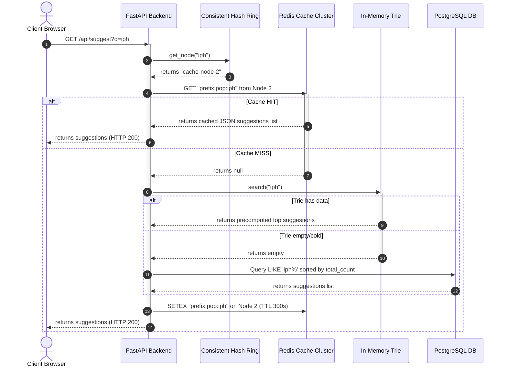

# System Architecture: Scalable Search Typeahead System

This document provides a detailed overview of the system architecture, design decisions, data structures, algorithms, scalability options, and technical trade-offs chosen for the Search Typeahead System.

---

## 1. System Design

The system is designed as a distributed, low-latency, write-resilient typeahead search architecture.

### Component Diagram

```mermaid
graph TD
    User[Web Client Browser] -->|1. GET /api/suggest?q=prefix| Backend[FastAPI App Server]
    User -->|2. POST /api/search {query}| Backend

    %% Search Suggestion Route
    Backend -->|1.1 Hash query prefix| HashRing[Consistent Hash Ring]
    HashRing -->|1.2 Find Node Owner| Router[Redis Router Client]
    Router -->|1.3 Query Cache Key| Redis1[(Redis Node 1)]
    Router -->|1.3 Query Cache Key| Redis2[(Redis Node 2)]
    Router -->|1.3 Query Cache Key| Redis3[(Redis Node 3)]

    %% Trie Lookup / Cache Miss
    Backend -->|1.4 On Cache Miss| TrieService[Memory Trie Service]
    TrieService -->|1.5 Backup Fallback| PostgresDB[(PostgreSQL Database)]
    Backend -->|1.6 Populate Cache Node| Router
    
    %% Search Submission Queue
    Backend -->|2.1 Buffer Search Event| WriteBuffer[In-Memory Buffer Queue]
    WriteBuffer -->|2.2 Periodic Batch Flush 30s/100| PostgresDB
    PostgresDB -->|2.3 Auto Trigger Reload| TrieService
```

### Flow Sequence: Autocomplete Suggestion



---

## 2. Database Design

We employ a relational schema designed for persistent storage, historical analytical queries, and time-window indexing.

### Schema

#### Table: `search_queries`
Stores the search phrases and their cumulative search count.
* `id` (INTEGER, Primary Key): Autoincrement unique identifier.
* `query` (VARCHAR(255), Unique, Indexed): The searched text. Normalised to lower-case.
* `total_count` (INTEGER, Default 1, Indexed): The total lifetime search submissions.
* `created_at` (TIMESTAMP WITH TIME ZONE): Record creation timestamp.
* `updated_at` (TIMESTAMP WITH TIME ZONE, Indexed): The last time the query was flushed from buffer.

#### Table: `search_events`
Stores individual search submission events for sliding-window trending calculation.
* `id` (INTEGER, Primary Key): Unique event index.
* `query` (VARCHAR(255), Indexed): The text submitted.
* `timestamp` (TIMESTAMP WITH TIME ZONE, Indexed): Precise time of search submission.

### Indexes & Performance Optimizations
1. **B-Tree Index on `search_queries(query varchar_pattern_ops)`**:
   Standard index structures in PostgreSQL are optimized for exact matches or range comparisons. To speed up prefix searches (e.g. `LIKE 'iphone%'`), we index the query text using `varchar_pattern_ops`. This forces PostgreSQL to traverse a B-tree by character codes, matching the query prefix in $O(\log N)$ time, instead of performing full-table scans.
2. **Compound Index on `search_queries(total_count DESC, updated_at DESC)`**:
   Ensures that sorting by global count remains highly optimized.
3. **Index on `search_events(timestamp)`**:
   Allows sliding-window aggregation queries (e.g., searches in the last hour/day) to discard old event rows immediately without scanning table rows.

---

## 3. Trie-Based Autocomplete Service

A **Trie (Prefix Tree)** is loaded in-memory on application startup and updated dynamically.

### Structure
* Each character in a query string maps to a node child link.
* **Precomputed Suggestion Lists**: Traditional Tries require traversing the node representing the prefix, then running a Depth-First Search (DFS) across all leaf nodes in that subtree to collect matches, and sorting them. In a large database, a DFS for short prefixes (like `a` or `s`) has high CPU cost.
  * **Optimization**: Each `TrieNode` stores a list `top_suggestions` containing the top 10 queries passing through that node.
  * **Lookup Complexity**: Reduced from $O(L + M \log M)$ (where $L$ is prefix length and $M$ is matching queries in subtree) to **$O(L)$**, resolving search recommendations instantly in microseconds.
  * **Insertion Strategy**: Queries are sorted by their scores descending *prior* to inserting them into the Trie. The first 10 queries that visit a node during building are guaranteed to be the highest scored queries, which are appended directly to the node's `top_suggestions`.

### Dynamic Rebuilds (Double-Buffering)
To reflect database modifications (batch queue flushes or scheduler scores updates) without causing locking issues for concurrent reads:
* The system builds a new Trie instance in the background.
* Once the construction completes, the pointer is swapped atomically under a Lock (`_trie = new_trie`).
* Read queries access the active pointer without getting blocked by build threads.

---

## 4. Consistent Hashing Caching Strategy

To prevent a single Redis cache instance from becoming a hot bottleneck, prefix suggestions are partitioned across three logical cache nodes: `cache-node-1`, `cache-node-2`, and `cache-node-3`.

### Consistent Hash Ring
* **Virtual Nodes**: To prevent hash imbalance (where one node owns disproportionately more keyspace than others), we map **50 virtual nodes (replicas)** per physical node on the ring.
* **Key Hashing**: We hash the prefix query using MD5, converting it to a 32-bit unsigned integer.
* **Routing**: The prefix hash points to the nearest virtual node on the ring clockwise.
* **Resilience**: If a cache node goes offline, only $1/N$ keys are invalidated and redistributed, avoiding a cascading database overload.

---

## 5. Batch Writes & Aggregation

To shield the PostgreSQL database from write saturation (I/O bottlenecks) during high traffic:
1. When `/api/search` is called, the query is pushed to a thread-safe, in-memory queue.
2. An asynchronous background thread flushes the queue when:
   * **Size Limit**: More than 100 items accumulate.
   * **Time Limit**: 30 seconds elapse since the last flush.
3. During flush, duplicate queries are aggregated: e.g., `["iphone", "iphone", "iphone", "react"]` compiles to `{"iphone": 3, "react": 1}`.
4. The system executes a bulk upsert:
   ```sql
   INSERT INTO search_queries (query, total_count, created_at, updated_at)
   VALUES (:query, :count, NOW(), NOW())
   ON CONFLICT (query) DO UPDATE
   SET total_count = search_queries.total_count + EXCLUDED.total_count,
       updated_at = EXCLUDED.updated_at;
   ```
5. All prefix keys of updated queries (e.g. `i`, `ip`, `iph`, `ipho`, `iphon`, `iphone`) are invalidated across the cache nodes to ensure suggestion fresh updates.

---

## 6. Recency-Aware Ranking Algorithm

Suggestions should not be sorted strictly by historical counts. A query searched 100,000 times last year might be less relevant than a hot query searched 1,000 times in the last hour.

### Score Formula
The system ranks suggestions by calculating a composite **Trending Score**:
$$\text{Score} = 0.7 \times \text{NormalizedTotalCount} + 0.3 \times \text{NormalizedRecentActivity}$$

Where:
* **$\text{NormalizedTotalCount}$**: $Count_{query} / MaxCount_{global}$
* **$\text{NormalizedRecentActivity}$**: $RecentActivityScore_{query} / MaxRecentScore_{global}$
* **$\text{RecentActivityScore}$**: Calculated using decaying weight bins for search events:
  $$\text{RecentActivityScore} = 1.0 \times Count_{1h} + 0.5 \times Count_{24h} + 0.1 \times Count_{7d}$$

This ensures that queries experiencing a sudden spike in search volume (e.g., during news events or product releases) float to the top of suggestion recommendations quickly.

---

## 7. Scalability & System Limits

1. **Memory limits**: Storing a Trie in memory for 100,000 queries takes less than 30MB of RAM. For 100,000,000 queries, this could exceed 30GB.
   * *Scale Path*: Partition the Trie by the first letter (e.g., Trie A handles prefixes starting with 'a', Trie B handles 'b') across multiple service containers (sharding).
2. **Cache node scale**: If a Redis cache node becomes saturated, we can expand the Consistent Hash Ring dynamically by registering `cache-node-4`, causing the ring to self-redistribute keys with minimal impact.
3. **Batch write crash vulnerability**: In-memory buffer batch writes present a durability trade-off. If the app container crashes, pending buffer increments are lost.
   * *Scale Path*: Replace the raw in-memory queue with Redis streams or an external message broker like RabbitMQ/Kafka for durability guarantees.
