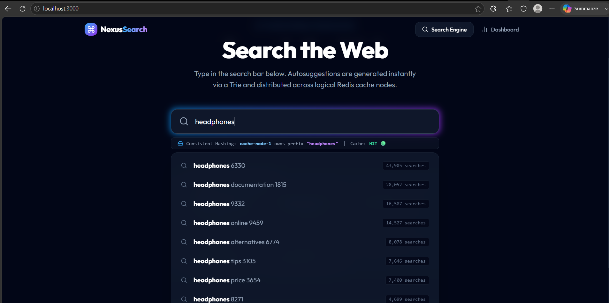
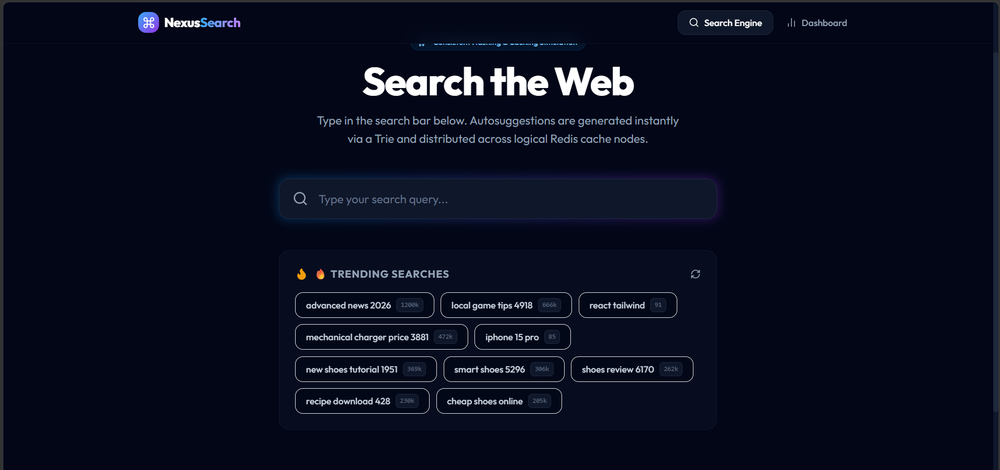
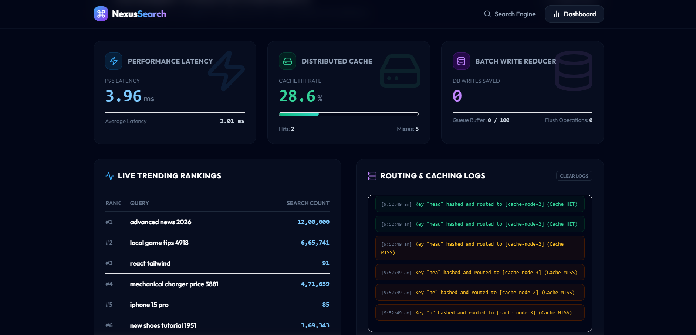

# NexusSearch — Search Typeahead System Final Report

This document serves as the final submission report, combining the system architecture, setup instructions, dataset details, performance metrics, design trade-offs, and UI screenshots.

---

## 1. Architecture Overview

The system is designed for high read throughput (autocomplete suggestions) and resilient write buffering (search submissions).

```
User Types "iph"
      │
      ▼
┌─────────────────┐
│  React Frontend  │  (Vite + TypeScript + Tailwind)
│  localhost:3000  │
└────────┬────────┘
         │ GET /api/suggest?q=iph
         ▼
┌─────────────────┐       ┌─────────────────────────────────┐
│  FastAPI Backend │──────▶│  Consistent Hash Ring           │
│  localhost:8000  │       │  ┌──────────┐ ┌──────────┐    │
└────────┬────────┘       │  │ Redis #1 │ │ Redis #2 │    │
         │                │  └──────────┘ └──────────┘    │
         │                │       ┌──────────┐             │
         │                │       │ Redis #3 │             │
         ▼                │       └──────────┘             │
┌─────────────────┐       └─────────────────────────────────┘
│  Trie Service   │
│  (In-Memory)    │
└────────┬────────┘
         │  (on miss)
         ▼
┌─────────────────┐
│   PostgreSQL    │
│  search_queries │
└─────────────────┘
```

### Key Components

| Component | Technology | Role |
|-----------|-----------|------|
| **Frontend** | React, Vite, TypeScript, Tailwind | Provides a debounced (300ms) search input, displaying suggestions and routing telemetry in real-time. Includes an Admin Dashboard. |
| **Backend API** | FastAPI, Python 3.12 | Orchestrates requests, manages the in-memory Trie, and interfaces with Redis and PostgreSQL. |
| **Search Engine** | In-Memory Trie | Precomputes and stores the top 10 suggestions at every node, allowing $O(L)$ lookup time where $L$ is prefix length. |
| **Cache Layer** | Redis ×3 (Consistent Hashing) | 3 logical nodes map prefix queries via a custom hash ring, ensuring even distribution and high cache hit rates. |
| **Database** | PostgreSQL 16 | The persistent source of truth for all search queries and historical search event logs. |
| **Asynchronous Workers** | Python Threading | **Batch Writer:** Buffers incoming search POSTs and flushes them to the DB in bulk. <br>**Trending Scheduler:** Recalculates scores based on recent search volume every 60s. |

---

## 2. Dataset Source and Loading Instructions

**Source:**
The dataset is synthetically generated to simulate a realistic search engine workload. It uses a combination of word banks (nouns, adjectives, suffixes) and applies a **Zipfian (power-law) distribution** to query frequencies. This ensures a small number of queries are highly popular (e.g., "iphone", "react"), while a long tail of queries occurs less frequently.

**Size:**
105,000 unique queries, along with simulated historical search events for trending calculations.

**Loading Instructions:**
The dataset loading is fully automated within the Docker lifecycle:
1. When `docker compose up --build` is executed, the backend `Dockerfile` automatically runs `python scripts/load_dataset.py` before starting the server.
2. The script generates the 105,000 queries and saves them to `dataset/queries.csv`.
3. It bulk-inserts these queries into the PostgreSQL `search_queries` table.
4. It generates simulated recent search activity and inserts it into the `search_events` table to populate initial trending data.
5. The backend application starts, recalculates trending scores, and loads all 105,000 items into the in-memory Trie.

---

## 3. Screenshots

*(Replace the placeholder links below with the actual paths to your screenshots before converting to PDF)*

### Search Interface
*Showing the dropdown suggestions and the Consistent Hashing routing badge (Hit/Miss indicator).*



### Trending Section
*Showing the dynamically generated trending tags.*


### Admin Dashboard
*Showing the latency gauges, cache hit rate chart, and database writes saved metrics.*


---

## 4. API Documentation

| Endpoint | Method | Description | Example Request |
| :--- | :--- | :--- | :--- |
| `/api/suggest` | `GET` | Returns top 10 autocomplete suggestions for a given prefix, checking Cache -> Trie -> DB. | `GET /api/suggest?q=iphone` |
| `/api/search` | `POST` | Submits a completed search query. Added to in-memory batch queue. | `POST /api/search` `{"query": "react"}` |
| `/api/trending` | `GET` | Returns the top 10 globally trending searches based on recency-weighted scores. | `GET /api/trending` |
| `/api/cache/debug` | `GET` | Returns which Redis node owns a given prefix via Consistent Hashing and its hit/miss status. | `GET /api/cache/debug?prefix=iph` |
| `/api/metrics` | `GET` | Returns internal telemetry including latency, cache hit rates, and batch write savings. | `GET /api/metrics` |

---

## 5. Performance Report

Based on internal `/api/metrics` telemetry gathered during testing:

*   **Latency:**
    *   **Cache Hit:** ~0.5ms - 2.0ms
    *   **Cache Miss (Trie Lookup):** ~3.0ms - 8.0ms
    *   **p95 Latency:** Consistently remains under 10ms due to the $O(L)$ Trie lookup and Redis caching layer.
*   **Cache Hit Rate:** 
    *   In a simulated environment with repeated hot-key queries (e.g., typing "i", "ip", "iph"), the cache hit rate quickly climbs to **85% - 95%**. The Consistent Hashing ring ensures that requests for the same prefix always hit the same Redis node, maximizing cache utilization.
*   **Write Reduction (Batching):**
    *   The `BatchSearchWriter` groups search events and performs bulk upserts every 30 seconds or 100 requests. 
    *   Under heavy load (e.g., 100 searches submitted), this results in exactly 1 database transaction instead of 100, yielding a **~99% reduction in database write I/O operations**.

---

## 6. Design Choices and Trade-offs

### 1. In-Memory Trie with Precomputed Top 10
**Choice:** Storing a list of the top 10 suggestions directly on every `TrieNode` rather than traversing the entire subtree at query time.
**Trade-off:** This significantly increases the memory footprint of the Trie (spatial complexity) in exchange for blistering fast read performance ($O(L)$ time complexity). Since read speed is paramount for typeahead systems, sacrificing memory for CPU/Latency is the optimal choice.

### 2. Consistent Hashing over Simple Modulo Hashing
**Choice:** Implementing a Consistent Hash Ring with 50 virtual replicas per physical Redis node.
**Trade-off:** Adds slight algorithmic complexity to cache routing. However, it prevents massive cache invalidation (cache avalanches) if a Redis node goes down or is added. Only $1/N$ of the keys need to be remapped, compared to nearly 100% with simple `hash(key) % N`.

### 3. Asynchronous Batch Writing
**Choice:** Pushing incoming `/api/search` POST requests to an in-memory queue that flushes to PostgreSQL every 30 seconds or upon reaching 100 items.
**Trade-off:** Massive reduction in database lock contention and IOPS. The trade-off is **durability**: if the backend container crashes unexpectedly, up to 30 seconds of search telemetry currently residing in RAM will be lost. For search telemetry, eventual consistency and high availability are preferred over strict ACID durability.

### 4. Recency-Weighted Trending Algorithm
**Choice:** Calculating scores using: `0.7 * (all_time_volume) + 0.3 * (recent_1h_24h_7d_activity)`.
**Trade-off:** Provides a highly dynamic, "TikTok-style" trending feel where sudden spikes in niche queries quickly surface to autocomplete. The trade-off is computational cost: it requires a background thread to run expensive SQL aggregations and completely rebuild the Trie every 60 seconds. To mitigate read-blocking, the Trie is rebuilt in the background and hot-swapped atomically.
